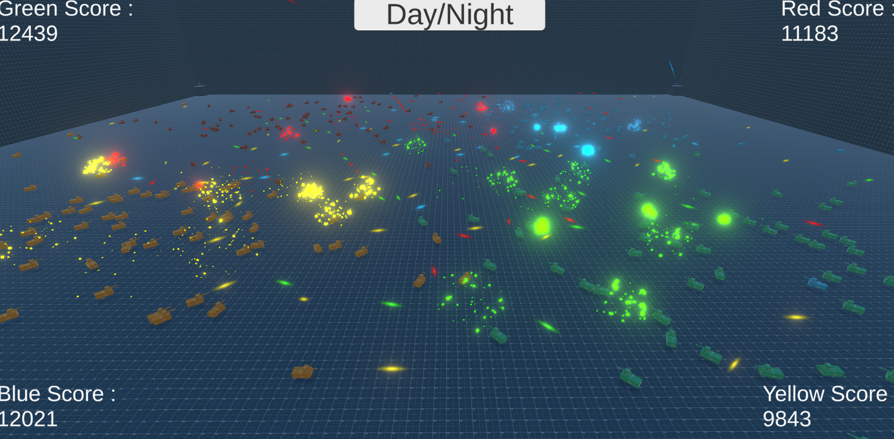

# Battle Simulation

A very small project I made several months ago. It was made using Unity Engine. 4 teams of tanks battle each other, each kill changing the score. Each tank spawned gain random values, meaning their movement and attack speed are randomized. Pc, Android, and WebGL builds are included.

## Sample Code

**Script that is responsible for spawning tanks**

```
using UnityEngine;

public class SpawnScript : MonoBehaviour
{
    [SerializeField]
    private GameObject tank;

    [SerializeField]
    private int minX, maxX, minZ, maxZ, tanksAtStart;


    void Start()
    {
        for (int i = 0; i<tanksAtStart; i++)
        {
            Instantiate(tank, new Vector3(Random.Range(minX, maxX), -48.0f, Random.Range(minZ, maxZ)), transform.rotation, gameObject.transform);
        }
    }

    
    void FixedUpdate()
    {
        if (Random.Range(0, 5) == 0)
        {
            Instantiate(tank, new Vector3(Random.Range(minX, maxX), -48.0f, Random.Range(minZ, maxZ)), transform.rotation, gameObject.transform);
        }
    }
}
```
`if (Random.Range(0, 5) == 0)` means that a tank has 1/6 chance of spawning every 0.01 seconds.


## Assets used

1. Gridbox prototype material
    + https://assetstore.unity.com/packages/2d/textures-materials/gridbox-prototype-materials-129127
2. Simple fx explosions
    + https://assetstore.unity.com/packages/vfx/particles/simple-fx-cartoon-particles-67834
    

## Post processing

Since the simulation looks a bit boring, I used an option to add post processing (*night mode*)

Post processing used:

+ All light are turned off

+ Bloom is turned on
    + This gives trails and explosions a glow



## To be added

~~More tank types~~

> Development has stopped
